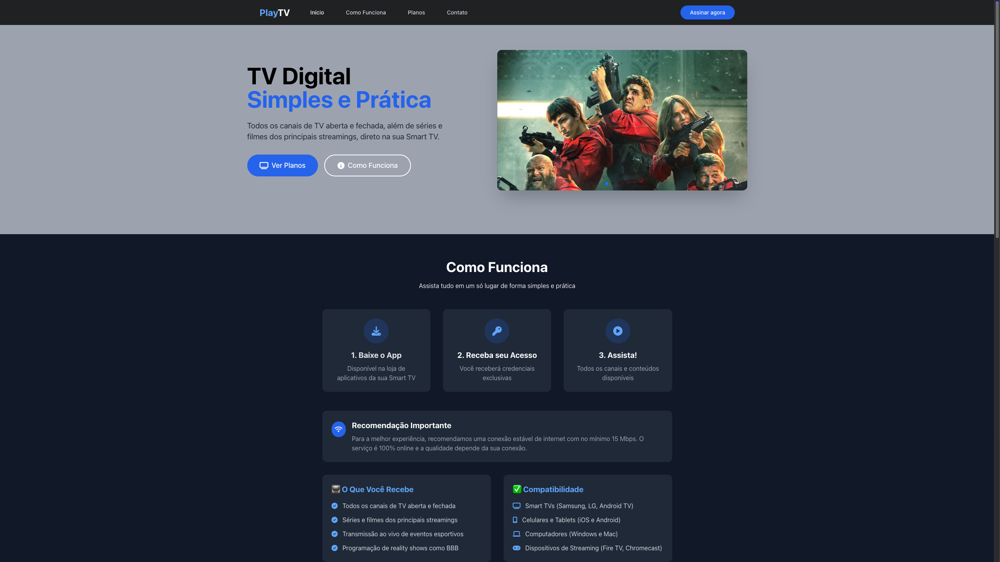

# PlayTV - Landing Page

Esta é uma landing page moderna e responsiva para um serviço de streaming fictício chamado PlayTV. O projeto foi desenvolvido como uma demonstração, utilizando tecnologias web front-end modernas para criar uma experiência de usuário fluida e agradável.

**[Ver Demonstração Ao Vivo](playtv-57felmglj-zmats-projects.vercel.app)**



---

## 📋 Tabela de Conteúdos

scs

- [Sobre o Projeto](#-sobre-o-projeto)
- [✨ Aspectos da Página](#-aspectos-da-página)
- [🚀 Tecnologias Utilizadas](#-tecnologias-utilizadas)
- [🔧 Como Executar Localmente](#-como-executar-localmente)
- [📁 Estrutura de Arquivos](#-estrutura-de-arquivos)
- [📄 Licença](#-licença)

---

## 📖 Sobre o Projeto

O objetivo deste projeto é criar uma página de apresentação completa para o serviço PlayTV. A página destaca os recursos, planos e informações de contato, com um design escuro (dark mode), profissional e focado na conversão de novos assinantes.

---

## ✨ Aspectos da Página

A página foi construída com atenção aos detalhes visuais e de interatividade:

### 1. **Design Moderno e Responsivo**

- Construído com **Tailwind CSS**, o site é totalmente responsivo e se adapta perfeitamente a desktops, tablets e celulares.
- A fonte principal utilizada é a **Inter**, importada do Google Fonts, garantindo uma ótima legibilidade.

### 2. **Navegação Fixa e Inteligente**

- A barra de navegação (`<nav>`) é fixa no topo da página com um efeito de `backdrop-blur`, criando uma aparência translúcida sobre o conteúdo.
- Os links de navegação possuem um efeito de sublinhado animado em CSS puro no `:hover`.

### 3. **Carrossel de Imagens Interativo (Hero Section)**

- Utiliza a biblioteca **Swiper.js** para criar um carrossel de imagens com efeito de _fade_.
- O carrossel possui _autoplay_, mudando de imagem a cada 3 segundos, e paginação customizada para combinar com a identidade visual do site.

### 4. **Animações e Micro-interações**

- **Fade-in ao Rolar:** Elementos como os textos e o carrossel na seção principal aparecem com uma animação suave de `fade-in` quando entram na tela. Isso é implementado de forma otimizada usando a `IntersectionObserver API` do JavaScript.
- **Efeito de Hover:** Os cards de planos e funcionalidades possuem um sutil efeito de "flutuar" (`translateY`) ao passar o mouse, incentivando a interação.

### 5. **Scripts Funcionais**

- **Menu Mobile:** Um menu funcional para dispositivos móveis é ativado ao clicar no ícone "hamburger", implementado com JavaScript.
- **Rolagem Suave (Smooth Scroll):** Clicar em qualquer link de navegação (ex: "Planos") leva o usuário à seção correspondente com uma animação de rolagem suave. O script calcula um deslocamento (`offset`) para compensar a altura da barra de navegação fixa.

---

## 🚀 Tecnologias Utilizadas

- **HTML5**
- **CSS3** (com algumas animações e estilos personalizados)
- **[Tailwind CSS](https://tailwindcss.com/)**: Framework CSS para prototipação rápida e design responsivo.
- **JavaScript (ES6+)**: Para interatividade do lado do cliente.
- **[Swiper.js](https://swiperjs.com/)**: Biblioteca para carrosséis modernos e responsivos.
- **[Font Awesome](https://fontawesome.com/)**: Para os ícones utilizados na página.
- **[Vercel](https://vercel.com/)**: Plataforma de deploy para publicação e hospedagem do site.

---

## 🔧 Como Executar Localmente

Para executar este projeto em sua máquina local, siga os passos abaixo:

1.  **Clone o repositório:**

    ```bash
    git clone [https://github.com/seu-usuario/seu-repositorio.git](https://github.com/seu-usuario/seu-repositorio.git)
    ```

2.  **Navegue até a pasta do projeto:**

    ```bash
    cd nome-da-pasta-do-projeto
    ```

3.  **Abra o arquivo `index.html`:**
    - Basta abrir o arquivo `index.html` diretamente no seu navegador de preferência.
    - **Recomendado:** Use uma extensão como o "Live Server" no VS Code para ter recarregamento automático ao salvar alterações nos arquivos.

---

## 📁 Estrutura de Arquivos

A estrutura de arquivos do projeto é simples e direta:

```
/
├── index.html         # O arquivo principal da página
├── styles.css         # Estilos personalizados e importações
├── scripts.js         # Lógica de interatividade da página
├── README.md          # Este arquivo de documentação
└── assets/            # Pasta para guardar as imagens
    ├── super.png
    ├── brb.png
    ├── got.jpeg
    └── strg.jpeg
```

---

## 📄 Licença

Este projeto está sob a licença MIT. Veja o arquivo `LICENSE` para mais detalhes.

---

_Projeto desenvolvido por Matheus Santana Dev._
